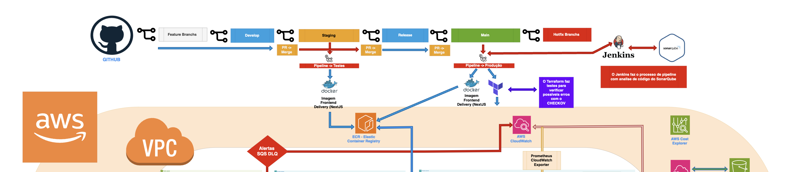

# Medical Clinic - Arquitetura de Solução em Nuvem AWS

### Visão Geral da Arquitetura
A Medical Clinic utiliza uma arquitetura de microserviços moderna e distribuída, implementada na AWS, focando em alta disponibilidade, escalabilidade e segurança.


## Índice
1. [Conceitos Fundamentais](#conceitos-fundamentais)
2. [Visão Geral do Projeto](#visão-geral-do-projeto)
3. [Arquitetura Detalhada](#arquitetura-detalhada)
4. [Pipeline e Fluxo de Desenvolvimento](#pipeline-e-fluxo-de-desenvolvimento)
5. [Componentes de Infraestrutura](#componentes-de-infraestrutura)
6. [Segurança e Conformidade](#segurança-e-conformidade)
7. [Monitoramento e Observabilidade](#monitoramento-e-observabilidade)

## Conceitos Fundamentais

### 1. O que é DevOps?
DevOps na Medical Clinic representa a união entre desenvolvimento e operações através de:
- Automatização de processos via pipelines CI/CD
- Infraestrutura como Código usando Terraform
- Containerização com Docker e orquestração com Kubernetes
- Monitoramento contínuo e observabilidade
- Práticas de segurança integradas ao desenvolvimento

### 2. Fases da Metodologia DevOps
Nossa implementação segue as seguintes fases:
- **Planejamento**: Levantamento de requisitos e design da arquitetura
- **Codificação**: Desenvolvimento seguindo GitFlow
- **Construção**: Criação de imagens Docker e testes unitários
- **Teste**: Testes automatizados em ambiente de staging
- **Implantação**: Deploy automatizado via GitHub Actions
- **Operação**: Gestão da infraestrutura e aplicação
- **Monitoramento**: Utilização de CloudWatch e ferramentas de observabilidade
- **Feedback**: Melhoria contínua baseada em métricas

### 3. CI/CD e Ferramentas
Implementamos:
- **CI (Integração Contínua)**:
  - GitHub Actions para automação de builds
  - Testes automatizados
  - Análise de código
- **CD (Entrega Contínua)**:
  - Deploy automatizado para AWS EKS
  - Gestão de configuração com Terraform
- **Ferramentas**:
  - GitHub Actions
  - Docker
  - Terraform
  - AWS ECR
  - Kubernetes

### 4. SLO (Service Level Objectives)
Implementamos os seguintes objetivos:
- **Disponibilidade**: 99.9% de uptime
- **Latência**: < 2 segundos para acesso aos exames
- **Taxa de Erro**: < 0.1% nas operações
- **Monitoramento**: AWS CloudWatch e Prometheus

## Visão Geral do Projeto

### Objetivo
Desenvolver uma plataforma segura e escalável para disponibilização online de resultados de exames médicos, permitindo acesso 24/7 aos pacientes.

### Desafios Atuais
- Dificuldade na localização de resultados
- Atrasos no envio por e-mail
- Necessidade de acesso remoto
- Volume diário de 1.000 exames
- Picos de acesso em horários específicos

### Requisitos Principais
- Acesso seguro via login
- Disponibilidade global
- Capacidade de download e impressão
- Notificação automática de resultados
- Alta disponibilidade em horários de pico

## Arquitetura dos microserviços
**Microsserviços principais (usando Java Spring):**

-   Accounts Service: Gestão de usuários e autenticação
-   Exam Results Service: Gerenciamento de exames
-   Notification Service: Envio de notificações
-   File Management Service: Gestão de arquivos PDF/documentos

**Clean Architecture em cada microsserviço:**

-   Core Domain (Entities, Use Cases)
-   Application Layer (Controllers, DTOs)
-   Infrastructure Layer (Repositories, External Services)
-   Interface Layer (APIs, Event Handlers)

## Microserviços e Eventos

#### 1. Serviço de Contas (Accounts Service)
**Eventos Publicados:**
- Gerenciamento de Contas
  - Criação de nova conta
  - Atualização de dados cadastrais
  - Remoção de conta
- Registro de Usuários
  - Cadastro de novo médico
  - Cadastro de novo paciente

#### 2. Serviço de Exames (Exam Results Service)
**Eventos Publicados:**
- Ciclo de Vida do Exame
  - Registro de novo exame
  - Atualização de informações
  - Finalização do exame
  - Disponibilização de resultados

**Eventos Consumidos:**
- Integrações com Contas
  - Vinculação de contas a exames
  - Validação de médicos
  - Associação com pacientes

#### 3. Serviço de Gestão de Arquivos (File Management Service)
**Eventos Publicados:**
- Gestão de Documentos
  - Upload de arquivos
  - Processamento concluído
  - Remoção de arquivos

**Eventos Consumidos:**
- Integração com Exames
  - Processamento de arquivos de exames
  - Anexação de resultados

#### 4. Serviço de Notificações (Notification Service)
**Eventos Consumidos:**
- Comunicações
  - Boas-vindas para novas contas
  - Confirmação de agendamentos
  - Conclusão de exames
  - Disponibilidade de resultados
  - Conclusão de processamentos

## Arquitetura Cloud AWS

### Componentes Principais

#### 1. Frontend
- **CloudFront** para distribuição global de conteúdo
- **S3** para armazenamento estático
- **Route 53** para DNS e balanceamento

#### 2. Backend
- **EKS (Elastic Kubernetes Service)**:
  - Microserviços em containers
  - Auto-scaling baseado em demanda
  - Alta disponibilidade

#### 3. Armazenamento
- **RDS** para dados estruturados
- **S3** para armazenamento de exames
- **ElastiCache** para caching

#### 4. Segurança
- **WAF** para proteção contra ataques
- **GuardDuty** para detecção de ameaças
- **KMS** para criptografia
- **Cognito** para autenticação

## Estrutura de Bancos de Dados por Microserviço

**1\. Accounts Service**

-   Banco Principal: Amazon RDS PostgreSQL
    -   Melhor para dados estruturados de usuários
    -   Suporte a transações ACID
    -   Ótimo para relações complexas de perfis e permissões
-   Redis (ElastiCache):
    -   Caching de sessões de usuário
    -   Armazenamento de tokens JWT
    -   Rate limiting
    -   Cache de dados de perfil frequentemente acessados

**2\. Exam Results Service**

-   Banco Principal: Amazon RDS PostgreSQL
    -   Armazena metadados dos exames
    -   Relacionamentos entre pacientes e exames
    -   Histórico de exames
-   Redis (ElastiCache):
    -   Cache de resultados recentes
    -   Fila de processamento prioritário
    -   Cache de dados frequentemente acessados
    -   Controle de rate limiting para downloads

**3\. File Management Service**

-   Banco Principal: Amazon DynamoDB
    -   Metadata dos arquivos
    -   Links para S3
    -   Histórico de versões
-   Armazenamento de arquivos: Amazon S3
    -   PDFs dos exames
    -   Documentos anexos
    -   Backups

**4\. Notification Service**

-   Banco Principal: MongoDB
    -   Flexibilidade para diferentes tipos de notificações
    -   Fácil escalabilidade
    -   Bom para logs de notificações
-   Redis (ElastiCache):
    -   Fila de notificações pendentes
    -   Cache de templates de notificação
    -   Controle de rate limiting para envios
    -   Tracking de notificações em tempo real

**Uso do Redis (ElastiCache) para funções globais:**

1.  **Rate Limiting**

    -   Controle de requisições por usuário
    -   Proteção contra abusos
    -   Limites de download
2.  **Caching Distribuído**

    -   Cache de dados frequentes
    -   Redução de carga nos bancos principais
    -   Melhoria de performance
3.  **Session Management**

    -   Gerenciamento de sessões
    -   Tokens de autenticação
    -   Estado temporário
4.  **Real-time Features**

    -   Status de processamento
    -   Notificações em tempo real
    -   Fila de prioridades

### Considerações Gerais sobre os Bancos de Dados

#### Sincronização e Consistência
- Implementação de padrão Event Sourcing
- Uso de mensageria para sincronização
- Garantia de consistência eventual
- Backup e recuperação automatizados

#### Segurança
- Criptografia em repouso
- Controle de acesso granular
- Auditoria de operações
- Isolamento por VPC

#### Performance
- Índices otimizados
- Estratégias de cache
- Monitoramento contínuo
- Auto-scaling configurado

#### Manutenção
- Backups automatizados
- Janelas de manutenção programadas
- Monitoramento de performance
- Políticas de retenção de dados

## Pipeline e Fluxo de Desenvolvimento

### GitFlow
Nossa estratégia de branches segue o modelo GitFlow adaptado:



1. **Main (Master)**
   - Branch principal de produção
   - Sempre estável e pronta para deploy
   - Protegida, requer aprovação para merges

2. **Develop**
   - Branch principal de desenvolvimento
   - Integração contínua de novas features
   - Base para criação de feature branches

3. **Feature Branches**
   - Criadas a partir de 'develop'
   - Nomenclatura: `feature/nome-da-funcionalidade`
   - Isolamento de desenvolvimento de novas funcionalidades

4. **Release Branches**
   - Preparação para releases
   - Criadas a partir de 'develop'
   - Nomenclatura: `release/v1.x.x`

5. **Hotfix Branches**
   - Correções urgentes em produção
   - Criadas a partir de 'main'
   - Merge tanto em 'main' quanto em 'develop'

### Pipeline CI/CD

#### 1. Integração Contínua (GitHub Actions)
- **Build**
  - Construção de imagens Docker
  - Testes unitários
  - Análise de código estático
  - Verificação de vulnerabilidades

- **Testes**
  - Testes de integração
  - Testes de segurança
  - Validação de qualidade de código

#### 2. Entrega Contínua (Jenkins)
- **Staging**
  - Deploy automático em ambiente de staging
  - Testes de aceitação
  - Validação de performance

- **Produção (main)**
  - Deploy controlado em produção
  - Rollback automatizado em caso de falhas
  - Monitoramento pós-deploy

### Componentes da Arquitetura

#### 1. Containerização (Docker)
- **Microserviços**
  - Serviço de Gestão de Exames
  - Serviço de Autenticação
  - Serviço de Notificações
  - Serviço de Armazenamento

- **Benefícios**
  - Isolamento de aplicações
  - Escalabilidade independente
  - Facilidade de deploy

#### 2. Orquestração (EKS - Elastic Kubernetes Service)
- **Clusters**
  - Cluster de Produção
  - Cluster de Staging
  - Auto-scaling configurado

- **Configurações**
  - Deployment strategies
  - Health checks
  - Load balancing

#### 3. Armazenamento e Dados
- **Amazon RDS**
  - Banco de dados principal
  - Réplicas para alta disponibilidade
  - Backup automatizado

- **Amazon S3**
  - Armazenamento de exames
  - Versionamento de arquivos
  - Políticas de retenção

## Sistema de Mensageria e Integrações

### Tópicos SQS e as integrações entre os serviços

**1\. Accounts Service**

Publica:

-   `account.created` - Quando uma nova conta é criada
-   `account.updated` - Quando dados da conta são atualizados
-   `account.deleted` - Quando uma conta é removida
-   `doctor.registered` - Quando um novo médico é registrado
-   `patient.registered` - Quando um novo paciente é registrado


**2\. Exam Results Service**

Publica:

-   `exam.created` - Quando um novo exame é registrado
-   `exam.updated` - Quando um exame é atualizado
-   `exam.completed` - Quando um exame é finalizado
-   `exam.result.ready` - Quando o resultado está disponível

Consome:

-   `account.created` - Para vincular conta ao exame
-   `doctor.registered` - Para validar médico responsável
-   `patient.registered` - Para vincular paciente ao exame

**3\. File Management Service**

Publica:

-   `file.uploaded` - Quando um arquivo é carregado
-   `file.processed` - Quando um arquivo é processado
-   `file.deleted` - Quando um arquivo é removido

Consome:

-   `exam.completed` - Para processar arquivos do exame
-   `exam.result.ready` - Para anexar resultados

**4\. Notification Service**

Consome:

-   `account.created` - Notifica boas-vindas
-   `exam.created` - Notifica agendamento
-   `exam.completed` - Notifica conclusão
-   `exam.result.ready` - Notifica disponibilidade
-   `file.processed` - Notifica processamento concluído


### Fluxos de Integração

#### Fluxo de Cadastro
1. Account Service registra novo usuário
2. Notification Service envia boas-vindas
3. Exam Service recebe dados para vinculação

#### Fluxo de Exames
1. Exam Service registra novo exame
2. Notification Service comunica agendamento
3. File Service prepara estrutura de arquivos
4. Notification Service informa conclusões

#### Fluxo de Documentos
1. File Service processa documentos
2. Exam Service atualiza status
3. Notification Service informa disponibilidade

### Políticas e Configurações

#### Gestão de Falhas
- Filas de Dead Letter (DLQ)
  - Retenção: 14 dias
  - Máximo de tentativas: 3
- Política de Retentativas
  - Máximo de retries: 3
  - Taxa de backoff: 2x
  - Delay inicial: 1 segundo

#### Configurações de Filas
- Timeout de visibilidade: 30 segundos
- Tempo de espera de mensagens: 20 segundos
- Tamanho de lote: 10 mensagens

Arquitetura de Segurança
------------------------

A arquitetura de segurança implementada segue um modelo em camadas, garantindo proteção em diferentes níveis:

### Fluxo de Entrada

1.  **Route 53** → **WAF** → **Shield** → **CloudFront** → **Application Load Balancer** → **Recursos VPC**

```
graph LR
    A[Route 53] --> B[WAF]
    B --> C[Shield]
    C --> D[CloudFront]
    D --> E[ALB]
    E --> F[Recursos VPC]

```

### Recursos de Segurança

#### WAF (Web Application Firewall)

-   Proteção contra ataques web (XSS, SQLi)
-   Regras de segurança personalizáveis
-   Filtragem de tráfego malicioso
-   Rate limiting

#### Shield

-   Proteção DDoS em camadas 3/4 e 7
-   Mitigação automática de ataques
-   Proteção da infraestrutura AWS

#### GuardDuty

-   Detecção de ameaças inteligente
-   Monitoramento contínuo de:
    -   CloudTrail Logs
    -   VPC Flow Logs
    -   DNS Queries
    -   S3 Access Logs

### Automação de Segurança

#### EventBridge + Lambda

O EventBridge atua como roteador de eventos, direcionando achados do GuardDuty para ações automatizadas via Lambda:

##### Severidade Alta (7-10)

-   Bloqueio automático de IPs suspeitos
-   Isolamento de recursos comprometidos
-   Notificação imediata para equipe
-   Criação de tickets de incidente

##### Severidade Média (4-6)

-   Notificação para equipe
-   Registro de ocorrência
-   Monitoramento elevado

##### Severidade Baixa (1-3)

-   Registro em logs
-   Monitoramento padrão

### Security Hub

Centraliza a visibilidade de segurança:

-   Avaliações de conformidade
-   Análise de configurações
-   Integração com AWS Config
-   Monitoramento de Security Groups

### Monitoramento e Logs

#### CloudTrail

-   Auditoria de atividades AWS
-   Armazenamento em S3
-   Integração com CloudWatch Logs
-   Análise via Athena

#### CloudWatch

-   Métricas de segurança
-   Dashboards personalizados
-   Alertas configuráveis
-   Integração com SNS

### Melhores Práticas Implementadas

1.  **Security Groups**

    -   Princípio de menor privilégio
    -   Revisão periódica de regras
    -   Documentação de mudanças
    -   Monitoramento de alterações
2.  **Networking**

    -   Segmentação de rede
    -   VPC endpoints
    -   Network ACLs
    -   Encrypted traffic only
3.  **Identity & Access**

    -   IAM roles específicas
    -   MFA obrigatório
    -   Rotação de credenciais
    -   Auditoria regular

### Resposta a Incidentes

```
graph TD
    A[Detecção] --> B[Avaliação]
    B --> C[Contenção]
    C --> D[Erradicação]
    D --> E[Recuperação]
    E --> F[Lições Aprendidas]

```

1.  **Detecção**

    -   GuardDuty
    -   CloudWatch Alerts
    -   Security Hub
2.  **Automação**

    -   EventBridge Rules
    -   Lambda Functions
    -   SNS Notifications
3.  **Documentação**

    -   Tickets automáticos
    -   Logs centralizados
    -   Relatórios de incidentes

### Contatos de Segurança

-   **Emergências**: [email/telefone]
-   **Reportar Vulnerabilidade**: [email/formulário]
-   **Equipe de Segurança**: [canal de comunicação]

### Atualizações de Segurança

-   Revisão mensal de configurações
-   Atualizações semanais de regras
-   Testes trimestrais de resposta
-   Auditorias semestrais

### Monitoramento e Observabilidade

**Utilizando ferramentas como Elastic stack, Prometheus e Grafana, segue os PRÓS de manter a Stack Completa para logs, métricas e alarmes:**

1.  **Observabilidade Completa**

-   Visão 360° do ambiente
-   Correlação entre diferentes fontes
-   Troubleshooting eficiente
-   Análise profunda de problemas
-   Monitoramento em tempo real

1.  **Flexibilidade**

-   Queries poderosas (PromQL)
-   Visualizações customizadas
-   Integração com múltiplas fontes
-   Adaptabilidade a diferentes casos
-   Extensibilidade

1.  **Maturidade das Ferramentas**

-   Comunidade ativa
-   Documentação robusta
-   Plugins e integrações
-   Casos de uso comprovados
-   Suporte empresarial disponível

1.  **Casos de Uso Específicos**

```
graph TD
    A[Use Cases]
    A --> B[Prometheus]
    A --> C[Elastic Stack]
    A --> D[Grafana]

    B --> E[Métricas de Aplicação]
    B --> F[Alertas em Tempo Real]

    C --> G[Análise de Logs]
    C --> H[APM]

    D --> I[Dashboards Unificados]
    D --> J[Visualização de Dados]
```

#### Métricas Principais
- Taxa de processamento
- Latência de eventos
- Erros de processamento
- Mensagens em DLQ

#### Alertas
- Falhas de processamento
- Atrasos significativos
- Sobrecarga de filas
- Erros de integração

# Guia de Observabilidade - Dashboards e Métricas

## 1. Dashboards por Microsserviço

### 1.1 Accounts Service Dashboard

#### Painéis Principais:
1. **Requests per Second (RPS)**
   - Mostra requisições por segundo em cada endpoint
   - Ajuda a identificar picos de tráfego
   - Breakdown por tipo de requisição (GET, POST, etc.)
   - Threshold recomendado: alertar se RPS > 1000

2. **Authentication Success Rate**
   - Gauge mostrando taxa de sucesso de autenticação
   - Verde: > 95%
   - Amarelo: 90-95%
   - Vermelho: < 90%
   - Importante para segurança e experiência do usuário

3. **Active Sessions**
   - Número atual de sessões ativas
   - Útil para dimensionamento de recursos
   - Histórico de 24h para análise de padrões
   - Correlacionar com uso de memória

### 1.2 Exam Results Service Dashboard

#### Painéis Principais:

1.  **Processing Queue Length**

    -   Monitora tamanho da fila de processamento
    -   Ajuda a identificar gargalos
    -   Thresholds:
        -   Warning: > 100 exames
        -   Critical: > 500 exames
2.  **Processing Time Distribution**

    -   Heatmap mostrando distribuição de tempo
    -   Cores indicam concentração de valores
    -   Útil para identificar anomalias
    -   Objetivos de SLA:
        -   P50 < 200ms
        -   P95 < 500ms
        -   P99 < 1s

#### Métricas Implementadas:

```
@Service
public class ExamMetricsService {
    private final MeterRegistry registry;

    public void recordProcessingTime(String examType, long duration) {
        Timer.builder("exam.processing.duration")
             .tag("type", examType)
             .description("Exam processing duration")
             .publishPercentiles(0.5, 0.95, 0.99)
             .register(registry)
             .record(duration, TimeUnit.MILLISECONDS);
    }

    public void updateQueueSize(int size) {
        Gauge.builder("exam.queue.size", () -> size)
             .description("Current exam queue size")
             .register(registry);
    }
}
```

2\. Performance Monitoring Dashboard
------------------------------------

### 2.1 Recursos do Sistema

1.  **Memory Usage Panel**

    -   Monitoramento por área de memória (Heap/Non-Heap)
    -   Visualização de tendências
    -   Thresholds de alerta:
        -   Warning: 80% uso
        -   Critical: 90% uso
2.  **GC Pause Time**

    -   Impacto das coletas de lixo
    -   Identificação de problemas de memória
    -   Métricas importantes:
        -   Frequência de GC
        -   Duração das pausas
        -   Memória recuperada
3.  **Thread States**

    -   Visualização de estados das threads
    -   Detecção de deadlocks
    -   Monitoramento de thread pools
    -   Estados monitorados:
        -   Running
        -   Blocked
        -   Waiting
        -   Timed Waiting

### 2.2 Exemplo de Queries Prometheus

## Taxa de erros por serviço
sum(rate(http_server_requests_seconds_count{status=~"5.."}[5m])) by (service)
/ sum(rate(http_server_requests_seconds_count[5m])) by (service) * 100

## Latência média por endpoint
rate(http_server_requests_seconds_sum[5m])
/ rate(http_server_requests_seconds_count[5m])

## Uso de memória JVM
sum(jvm_memory_used_bytes{area="heap"}) by (application)


3\. Correlação de Métricas
--------------------------

### 3.1 Dashboards de Correlação

-   CPU vs Requisições
-   Memória vs Usuários Ativos
-   Latência vs Queue Size


```
{
  "dashboard": {
    "title": "Correlação de Métricas",
    "panels": [
      {
        "title": "CPU vs Requests",
        "targets": [
          {
            "expr": "sum(rate(container_cpu_usage_seconds_total[5m])) by (pod)",
            "legendFormat": "CPU Usage"
          },
          {
            "expr": "sum(rate(http_requests_total[5m])) by (pod)",
            "legendFormat": "Request Rate"
          }
        ]
      }
    ]
  }
}

```

4\. Boas Práticas
-----------------

### 4.1 Organização de Dashboards

-   Hierarquia clara (Overview → Serviço → Componente)
-   Consistência em nomenclatura
-   Tags padronizadas
-   Documentação inline

### 4.2 Alertas Efetivos

-   Evitar falsos positivos
-   Definir severidade clara
-   Incluir contexto nas notificações
-   Documentar ações de resposta

### 4.3 Performance Metrics Checklist

-   [ ]  Latência (P50, P95, P99)
-   [ ]  Taxa de erros
-   [ ]  Throughput
-   [ ]  Utilização de recursos
-   [ ]  Saturação de serviços
-   [ ]  Métricas de negócio

### 4.4 Retenção de Dados

-   Hot data: 7 dias (alta resolução)
-   Warm data: 30 dias (média resolução)
-   Cold data: 1 ano (baixa resolução)

### Segurança e Compliance

#### 1. AWS Security
- **VPC (Virtual Private Cloud)**
  - Isolamento de rede
  - Subnets públicas e privadas
  - Security Groups customizados

- **IAM (Identity and Access Management)**
  - Políticas de menor privilégio
  - Roles específicas por serviço
  - MFA para acesso administrativo

#### 2. Monitoramento e Logs
- **CloudWatch**
  - Métricas de performance
  - Logs centralizados
  - Alertas configurados

- **X-Ray**
  - Tracing distribuído
  - Análise de performance
  - Debugging de produção

### Observabilidade

#### 1. Métricas Principais (SLIs)
- Tempo de resposta
- Taxa de sucesso
- Disponibilidade
- Utilização de recursos

#### 2. Dashboards
- Monitoramento em tempo real
- Histórico de performance
- Análise de tendências

#### 3. Alertas
- Notificações proativas
- Escalação automática
- Playbooks de resposta a incidentes

### Custos e Otimização
- Tags para controle de custos
- Auto-scaling baseado em demanda
- Reservas de instâncias para economia

#### 1. Prometheus
**Responsabilidades:**
- Coleta de métricas dos microserviços
- Armazenamento de dados temporais
- Agregação de métricas operacionais
- Monitoramento de:
  - Saúde dos serviços
  - Performance das APIs
  - Uso de recursos
  - Métricas de negócio

#### 2. Grafana
**Funcionalidades:**
- Visualização de dados em tempo real
- Dashboards customizados por serviço
- Painéis específicos para:
  - Performance de exames
  - Taxa de processamento de arquivos
  - Métricas de notificações
  - Saúde geral do sistema

#### 3. Amazon CloudWatch
**Monitoramento:**
- Logs centralizados dos microserviços
- Métricas de infraestrutura AWS
- Alertas e notificações
- Rastreamento de custos

### Métricas Principais

#### Métricas de Negócio
- Taxa de processamento de exames
- Tempo médio de disponibilização de resultados
- Taxa de sucesso de notificações
- Volume de exames por período

#### Métricas Técnicas
- Latência das APIs
- Taxa de erros
- Uso de memória/CPU
- Tempo de resposta de banco de dados

#### Métricas de Infraestrutura
- Utilização de recursos AWS
- Performance de filas SQS
- Métricas de tópicos SNS
- Saúde dos serviços gerenciados

### Dashboards e Visualizações

#### Dashboard Operacional
- Status dos serviços
- Alertas ativos
- Métricas em tempo real
- Logs relevantes

#### Dashboard de Negócio
- KPIs principais
- Tendências de uso
- Métricas de satisfação
- Indicadores de performance

#### Dashboard de Infraestrutura
- Recursos AWS
- Custos
- Capacidade
- Performance

### Alertas e Notificações

#### Alertas Críticos
- Falhas em serviços
- Erros em processamento de exames
- Problemas de segurança
- Indisponibilidade de recursos

#### Alertas de Warning
- Alto uso de recursos
- Latência elevada
- Filas crescendo
- Tendências anormais

### Logs e Rastreamento

#### Estrutura de Logs
- Padronização JSON
- Campos obrigatórios
- Níveis de severidade
- Contexto da operação

#### Rastreamento Distribuído
- Trace ID único
- Correlação entre serviços
- Mapeamento de dependências
- Análise de performance

### Segurança e Compliance

#### Controle de Acesso
- IAM para serviços AWS
- Autenticação no Grafana
- Permissões por função
- Auditoria de acessos

#### Retenção de Dados
- Políticas de retenção
- Backup de métricas
- Armazenamento de logs
- Conformidade com regulações

### Implantação com GitHub Actions

    -   GitHub Actions é utilizado para construir, testar e implantar automaticamente os contêineres Docker.
    -   Ao realizar o merge para `main`, o pipeline executa a implantação no AKS.

* * * * *

Contribuição
--------------

Para contribuir com o projeto, siga o fluxo GitFlow descrito acima e abra um pull request para revisão. As contribuições devem ser documentadas e incluir testes para facilitar a integração com o sistema.

* * * * *

### Engenheiro Principal do Projeto

Projeto liderado e arquitetado por **Vinicius Prudencio**.